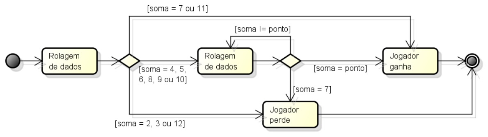

# ☕ Java Aplicado a Teste de Software..


## Este material foi desenvolvido em resposta a disciplina 'Teste de Software', a qual faz parte do curso de Pós Graduação em Tecnologia Java, ministrado pela Universidade Tecnológica Federal do Paraná.
🎉 Os projetos, são exercícios solicitados ao longo do curso que juntos perfazem a nota que compõem a média final.

🥋 Se você está entrando no Java agora, vou deixar um comentário apenas para orientá-lo, caso considere o código destes exercícios um pouco estranhos. Estes exercícios, compõem a disciplina TESTES e estão dispostos em vários níveis de dificuldade. Desde JUNIOR até HARD. (_😎tirei nota máxima em quase todos_♻️rsrsrs), contudo, o assunto aqui é TESTE DE SOFTWARE. Isso, por si só, não é nada convencional, pois, grande parte dos desenvolvedores não estão acostumados com teste e os desconsideram. Caso se identifique, considere que TESTE DE SOFTWARE é uma potencialidade do Java explorada por todos que se reservam o direito de escrever código de qualidade. Simplesmente, os TESTES participam de TODO ciclo de vida do projeto.

## 🎯 Por que testar?

        - Encontrar e corrigir defeitos no software antes que ele seja entregue ao cliente.
        - Garantir que o software atenda aos requisitos especificados.        
        - Verificar se o software atende aos padrões de qualidade definidos.
        - Garantir que o software seja confiável, eficiente e fácil de manter.        
        - Certificar-se de que o software implementa corretamente os requisitos do cliente.
        - Confirmar que o software atende às expectativas do usuário.        
        - Testar para garantir que o software é robusto e tolerante a falhas.
        - Verificar o comportamento do software sob diferentes condições.
        - Facilitar a detecção e correção de defeitos após o lançamento.
        - Manter a estabilidade do software durante as atualizações.
        - Demonstrar ao cliente que o software foi testado de maneira abrangente.
        - Construir a confiança do cliente na qualidade do produto...

## 🎯 O que testar?

- Ao conduzir testes de software, é crucial abordar diversos aspectos para garantir a qualidade e confiabilidade da aplicação. Aqui estão alguns elementos-chave que você deve considerar ao definir sua estratégia de teste:

1. Funcionalidades Principais:
   Teste todas as funcionalidades principais da aplicação para garantir que elas operem conforme o esperado. Isso inclui casos de uso críticos para o usuário final.
2. Caminhos de Usuário:
   Avalie os diversos caminhos que os usuários podem seguir dentro da aplicação. Certifique-se de testar cenários de navegação, interação e transições entre páginas ou telas.
3. Entradas do Usuário:
   Valide como a aplicação lida com diferentes tipos de entrada do usuário. Teste campos de formulários, caixas de seleção, botões e outras interações para garantir uma resposta adequada.
4. Edge Cases e Limites:
   Explore situações de limite e casos extremos para identificar possíveis vulnerabilidades ou comportamentos inesperados. Isso inclui testar valores mínimos, máximos e situações de erro.
5. Compatibilidade de Navegadores e Dispositivos:
   Verifique se a aplicação é compatível com uma variedade de navegadores e dispositivos. Teste em diferentes versões de navegadores e em dispositivos móveis para garantir uma experiência consistente.
6. Desempenho e Escalabilidade:
   Avalie o desempenho da aplicação, especialmente em condições de carga elevada. Teste a escalabilidade para garantir que a aplicação possa lidar com um número crescente de usuários.
7. Segurança:
   Conduza testes de segurança para identificar possíveis vulnerabilidades, como falhas de autenticação, injeções de código e outros ataques potenciais.
8. Integrações e APIs:
   Teste integrações com sistemas externos e APIs para garantir uma comunicação suave e a troca correta de dados.
9. Atualizações e Migrações:

   Se a aplicação estiver passando por atualizações ou migrações, certifique-se de testar os processos de forma abrangente para evitar problemas durante essas transições.
Lembre-se, um conjunto abrangente de testes não apenas assegura a qualidade do software, mas também contribui para uma experiência do usuário consistente e confiável.

## 🎯 Sobre as atividades..

### 👉 Atividades práticas:

1. **Projeto 1**:
   - [App](Exercicio%2002/identifier/src/main/java/br/identifierApp/App.java) - class main
   - [App](Exercicio%2002/identifier/src/test/java/br/identifierTest/AppTest.java) - class de test
     - (Exercicio 02) O programa deve determinar se um Identifier é válido ou não. Um identificador válido deve começar com uma letra e conter apenas letras e/ou dígitos. Além disso, deve ter no mínimo um caractere e no máximo seis caracteres de comprimento.

- Exemplos:

          - abc12 (válido);
          - cont*1 (inválido);
          - 1soma (inválido);
          - a123456 (inválido).

2. **Projeto 2**:
   - [Funcionarios](Exercicio%2003/CalcSalarFunc/src/main/java/br/calcSalarFunc/Funcionarios.java) - class objeto
   - [CalculadoraDeSalarioDeFuncionários](Exercicio%2003/CalcSalarFunc/src/main/java/br/calcSalarFunc/CalculadoraDeSalarioDeFuncionários.java) - class de apóio
   - [App](Exercicio%2003/CalcSalarFunc/src/test/java/serviceTest/CalcSalarFuncServiceTest.java) - class de test
     - (Exercicio 03) Seguindo um ciclo Test Driven Development (TDD), desenvolva as classes necessárias (usando a linguagem Java e o framework JUnit) para resolver o problema descrito abaixo:
        “O participante deve implementar uma calculadora de salário de funcionários. Um funcionário contém nome, e-mail, salário-base e cargo. De acordo com seu cargo, a regra para cálculo do salário líquido é diferente:

        Caso o cargo seja DESENVOLVEDOR, o funcionário terá desconto de 20% caso o salário seja maior ou igual que 3.000,00, ou apenas 10% caso o salário seja menor que isso.
        Caso o cargo seja DBA, o funcionário terá desconto de 25% caso o salário seja maior ou igual que 2.000,00, ou apenas 15% caso o salário seja menor que isso.
        Caso o cargo seja TESTADOR, o funcionário terá desconto de 25% caso o salário seja maior ou igual que 2.000,00, ou apenas 15% caso o salário seja menor que isso.
        Caso o cargo seja GERENTE, o funcionário terá desconto de 30% caso o salário seja maior ou igual que 5.000,00, ou apenas 20% caso o salário seja menor que isso.

- Exemplos de cálculo do salário:

        - DESENVOLVEDOR com salário-base 5,000.00. Salário final = 4.000,00
        - GERENTE com salário-base de 2.500,00. Salário final: 2.000,00
        - TESTADOR com salário de 550.00. Salário final: 467,50

2. **Projeto 3**:
   - [Craps](Exercicio%2004/br.craps/src/main/java/br/craps/craps.java) - class apóio
   - [Dado](Exercicio%2004/br.craps/src/main/java/br/craps/dado.java) - class apóio
   - [Main](Exercicio%2004/br.craps/src/main/java/br/craps/main.java) - class principal
   - [Test](Exercicio%2004/br.craps/src/test/java/br/craps/CrapsTest.java) - class de test
   
     - (Exercicio 04) Implementar em Java e testar com o JUnit com o uso de Mocks/Mockito o Jogo Craps:
        Craps(jogo de dados):
        – O jogador lança dois dados de seis faces. Depois que os dados param de rolar, calcula-se a soma dos pontos obtidos nos dois dados. Se a soma for 7 ou 11 no primeiro lance, o jogador ganha. Se a soma for 2, 3 ou 12 no primeiro lance, o jogador perde (a mesa ganha).
        – Se a soma for 4, 5, 6, 8, 9 ou 10 no primeiro lance, essa soma torna-se o ponto do jogador. Para ganhar, o jogador deve continuar a rolar os dados até atingir seu ponto (isto é, a soma deve ser igual ao ponto do jogador). O jogador perde se obtiver um 7 antes de atingir seu ponto.
  
### 🤔 Fluxo:


1. **Projeto 4**:
   - [MyRandomNumber](Exercicio%2005/gerador.aleatorio/src/main/java/br/gerador/aleatorio/MyRandomNumber.java) - class apóio
   - [IntervaloInvalidoException](Exercicio%2005/gerador.aleatorio/src/main/java/br/gerador/aleatorio/IntervaloInvalidoException.java) - class apóio
   - [MyRandomNumberTest](Exercicio 05/gerador.aleatorio/src/test/java/br/gerador/aleatorio/MyRandomNumberTest.java) - class de test
     - (Exercicio 05) Seguindo um ciclo Test Driven Development (TDD), desenvolva as classes abaixo usando JUnit para automatizar os testes do programa que gera um número aleatório em um intervalo:

public class MyRandomNumber {
    Random random = new Random();    
       
    /**
     *
     * @param begin inicio do intervalo
     * @param end fim do intervalo
     * @return retornar um numero aleatorio entre [begin, end]
     * o numero aleatorio retornado nao pode ser igual ao anterior
     * @throws IntervaloInvalidoException
     * essa excecao eh lancada quando begin >= end ou (begin<0 || end<0)
     *
     */

public class IntervaloInvalidoException extends Exception {
   
public IntervaloInvalidoException(String msg) {
        super(msg);
    }
}

### 👉 Atividades teóricas:


- Atividades Teóricas: correspondem a questionários sobre o assunto. Estão em arquivos do tipo .pdf e só podem ser visualizados após serem baixados. Existe uma pasta chamada: Exercícios Teóricos, onde estão os exercícios em forma de relatório, os quais foram solicitados pelo professor.


 

# Tecnologia utilizada:


## Tabela de Conteúdos

- [Instalação](#Instalação)
- [Uso](#Uso)
- [Contribuição](#Contribuição)

## Instalação

1. Clone o repositório ou baixe o arquivo .zip:

```bash
git clone https://github.com/alfecjo/testes.git
```
## Uso

1. Execute em sua IDE de preferência. Contudo, o desenvolvimento foi feito no Eclipse! Você pode começar com: "mvn install", no diretório raiz, que é onde se encontra o arquivo pom.xml. Desta forma, serão baixadas as dependências, caso seja necessário.
2. A idéia central aqui é entender os enunciados que correspondem aos testes, individualmente e montá-los, de preferência na IDE Eclipse, ou caso escolha outra IDE, sempre se faz necessário algumas modificações pontuais. Digo isso porquê já fiz testes no Eclipse (minha preferida para testes) e quando fui aplicar no IntelliJ, VSCode, NetBeans, tive esses problemas.
3. Caso tenha o Java instalado, você precisa apenas lidar com os arquivos .class.

## Contribuição

Contribuições são bem-vindas! Se você encontrar algum problema ou tiver sugestões de melhorias, abra um problema ou envie uma solicitação pull ao repositório.

Ao contribuir para este projeto, siga o estilo de código existente, [convenções de commit](https://www.conventionalcommits.org/en/v1.0.0/), e envie suas alterações em um branch separado.

Muito obrigado!!


